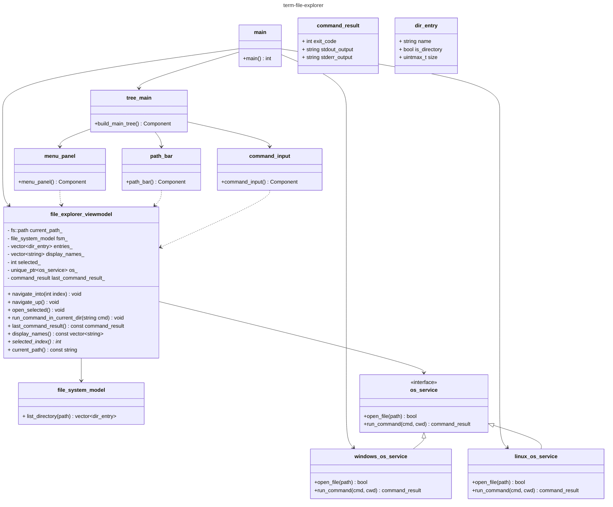
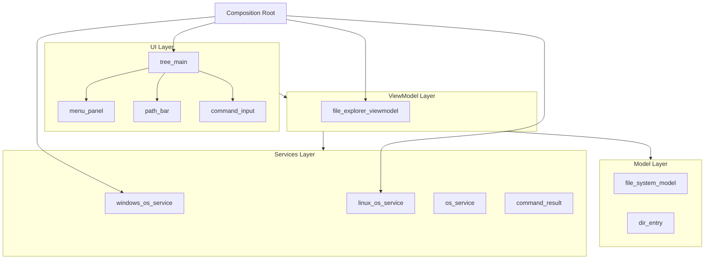
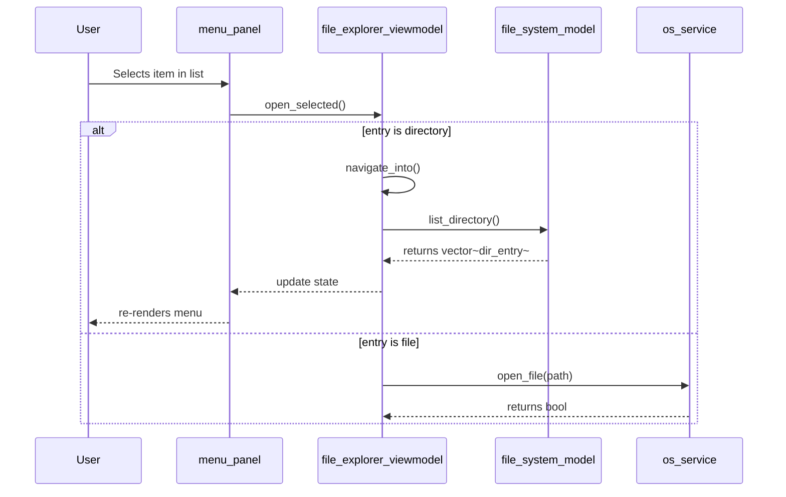
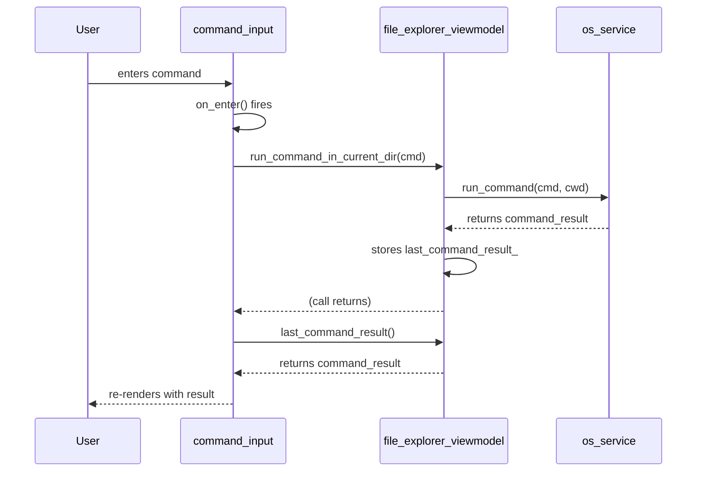
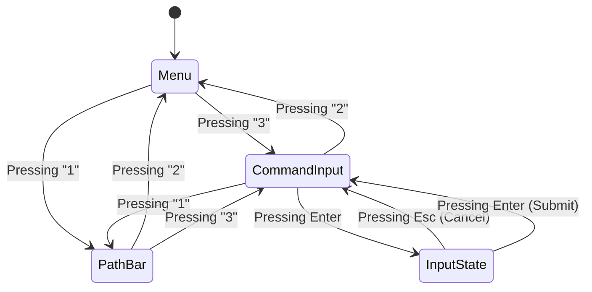

# Architecture <!-- omit from toc -->

## Contents <!-- omit from toc -->

- [Class Diagram](#class-diagram)
- [Component/Architecture Diagram](#componentarchitecture-diagram)
- [Sequence Diagram](#sequence-diagram)
  - [Navigating into a Directory](#navigating-into-a-directory)
  - [Running a Shell Command](#running-a-shell-command)
- [State Diagram](#state-diagram)

## Class Diagram
**Class Diagram Version 1.0**

## Component/Architecture Diagram
**Version 1.0**

## Sequence Diagram

### Navigating into a Directory
**Version 1.0**

### Running a Shell Command

This design is synchronous and may be blocking by design for now.

## State Diagram
**Version 1.0**

Needs updating with further input states (but this is the first iteration)