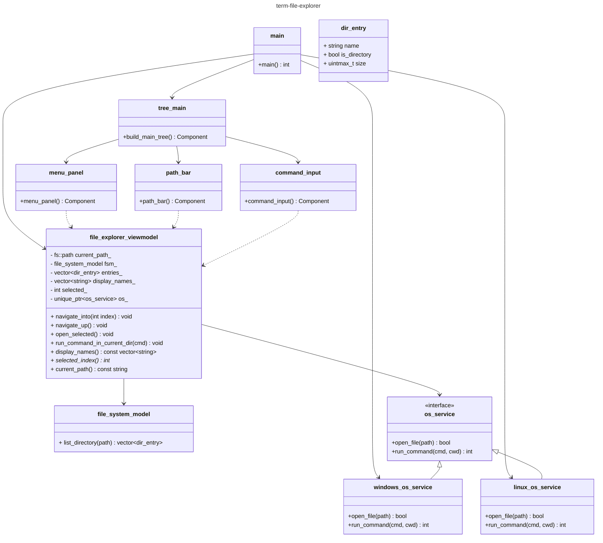
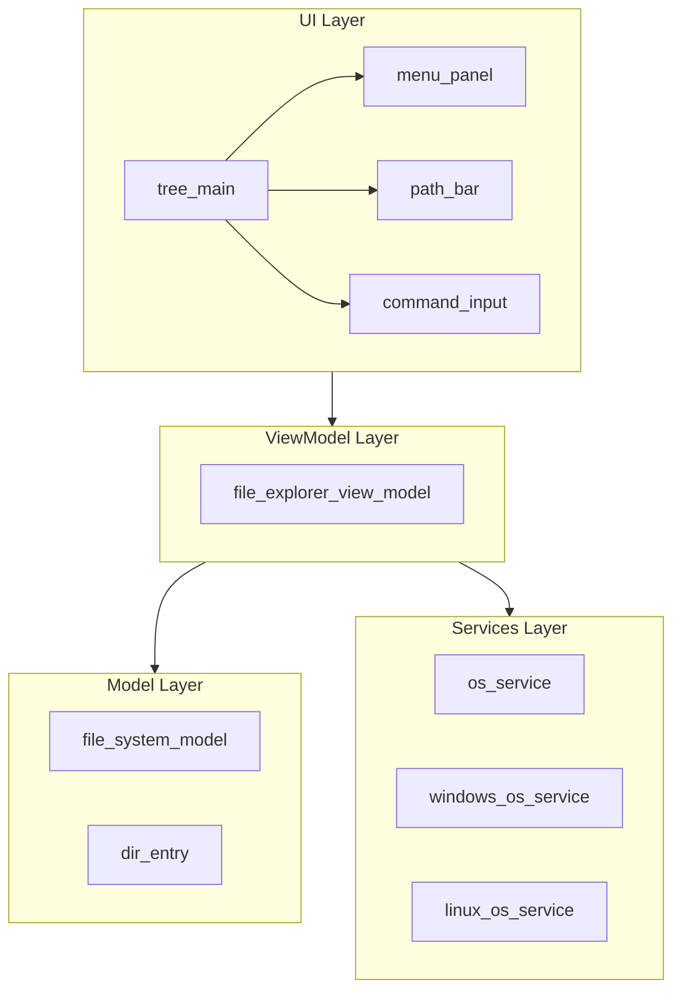

# Architecture <!-- omit from toc -->

## Contents <!-- omit from toc -->

- [Class Diagram](#class-diagram)
- [Component/Architecture Diagram](#componentarchitecture-diagram)
- [Sequence Diagram](#sequence-diagram)
- [State Diagram](#state-diagram)

## Class Diagram
**Class Diagram Version 1.0**

## Component/Architecture Diagram
**Version 1.0**

## Sequence Diagram

worth doing for navigation flow and the run-command flow 

## State Diagram
If the app has distict modes (browsing vs command input focused vs confirmation dialog), a state
diagram showing valid transitions can catch UI bugs before you write them.